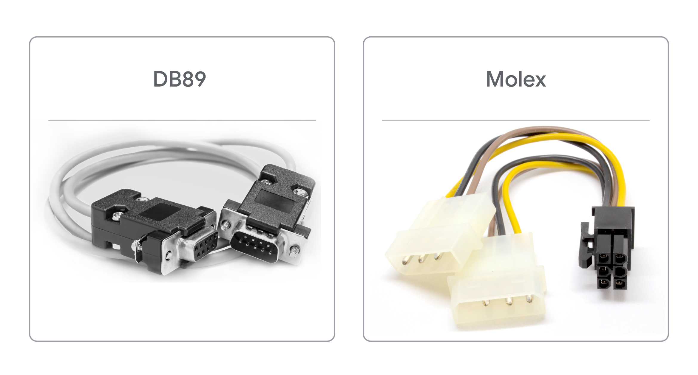
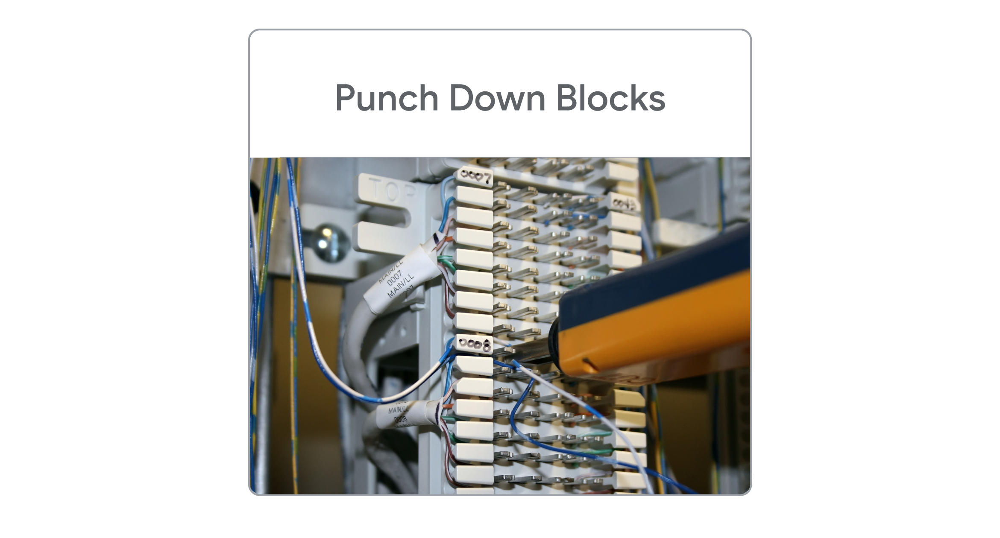

# Supplemental Reading for CPUs

## CPU cache and overclocking

In this reading, you will learn about the various levels of cache for central processing units (CPUs) and how a CPU processes and executes instructions. Additionally, you will learn about overclocking CPUs to maximize processing speeds. IT Support professionals may use this information when purchasing, allocating, and/or configuring high-performance servers.  

## Cache

You may already be familiar with the term “cache”. In computer jargon, cache (pronounced “cash”) refers to a small amount of recently used data that is stored either on hardware or in software. The first time data is accessed, both the initial request for the data and the reply containing the data pass through multiple points on their journey. Depending on several variables, these points might include I/O devices, motherboard busses, RAM, cables, hard drives, applications, networks, the internet, cloud platforms, and more. If a computer needed to use these full paths everytime it tried to access data, the entire transaction could take a relatively long time. Cache speeds up this process by holding a local copy of the most recently accessed data in temporary storage.    

## CPU cache

CPUs use a system of cache storage to help them quickly access data. A CPU cache is normally stored inside each core of the CPU. Older computers might store CPU cache in a transistor chip that is attached to the motherboard, along with a high-speed bus connecting the chip to the CPU. 

## CPU levels of cache

There are three levels of CPU cache memory:

- Level 3 cache: L3 cache is the largest and slowest of CPU cache. However, it is often twice as fast as RAM. L3 is the first CPU cache location to store data after it is transferred from RAM. L3 cache is often shared by all of the cores in a single CPU. 

- Level 2 cache: L2 cache holds less data than L3 cache, but it has faster access speeds. L2 holds a copy of the most recently accessed data that is not currently in use by the CPU. Each CPU core normally has its own L2 cache.

- Level 1 cache: L1 cache is the fastest and smallest of the three CPU cache levels. L1 holds the data currently in use by the CPU. Each CPU core usually has its own L1 cache.

## Overclocking a cpu 

Overclocking a CPU sets it to run at a higher CPU clock frequency rate than the manufacturer’s original specifications. For example, if a processor is labeled as having a 3.2 GHz base frequency rate, it may be possible to overclock the CPU to run at 3.5 GHz. Achieving a higher CPU clock frequency rate means the CPU can process a higher volume of instructions per nanosecond, resulting in faster performance. A computer user might want to overclock their CPU to improve sluggish speeds when performing processor-intensive tasks, like video editing or gaming. 

Overclocking a CPU’s frequency involves three variables:

- The base CPU clock frequency, often measured in GHz.

- The core frequency, which is calculated by multiplying the base frequency by the CPU core multipliers. 

- The core voltage, which needs to be increased in small increments to meet the increasing power demand of the CPU during the overclocking process.

## Warnings on overclocking

Overclocking the CPU can damage the computer if not configured properly. Operating a CPU at a higher speed can overheat the CPU and surrounding hardware, which can cause the computer system to fail. Additionally, overclocking the CPU can shorten the overall lifespan of the computer and void the computer’s warranty. It is better to avoid overclocking the CPU and instead purchase the appropriate CPU speed necessary to meet computing demands.  

## How to overclock a CPU safely

As an IT Support professional, you may be asked to overclock a CPU. There are steps you should follow to do this as safely as possible. Always make sure that the requestor understands the risks of overclocking before agreeing to perform this procedure. 

1. Check if overclocking is supported: First, make sure the CPU is a model that is unlocked for overclocking. Not all CPUs can support overclocking, including most laptop CPUs. Check the CPU manufacturer’s documentation to determine if overclocking is possible for the CPU model. Both Intel and AMD provide overclocking guides and tools for supported CPU models (see below for links to these guides). Additionally, check the documentation for the computer’s motherboard model to ensure that it can support an overclocked CPU.

2. Clean the inside of the computer: Turn off and unplug the computer. While wearing an anti-static wristband, open the computer and use compressed air to remove any dust build-up that has accumulated. It is especially important to remove any dust from around the CPU, fans, and intake vents.

3. Ensure an appropriate CPU cooler is installed (critical): If the computer has a stock CPU cooler, it is most likely insufficient for cooling an overclocked CPU. Replace the stock CPU cooler with an advanced cooling system, like a liquid cooling system.

4. Follow the manufacturer’s instructions for overclocking the CPU: Using the detailed instructions from the manufacturer (see below for links to Intel and AMD’s guides): 

    - Use benchmarking software to establish a baseline for the normal performance of the computer.

    - Set each CPU core multiplier to the value of the lowest multiplier using either the manufacturer’s overclocking software (recommended) or the BIOS. Then reboot the computer. 

   - Increase each CPU core multiplier by 1 to increase the CPU frequency. 

   - Test each increase for stability using the testing utility provided by the manufacturer. 

       - Fix any problems flagged by the testing tools, especially temperature alerts. If the system becomes too unstable, roll back to the last frequency that produced a stable performance and stop overclocking the CPU.

       - If the voltage appears to become insufficient to support the new frequency, increase the voltage by 0.05V. Do not increase the voltage above 1.4V without specialized cooling hardware.

       - If the computer freezes or crashes, it has either become completely unstable or the CPU is not getting enough voltage to support the overclocked frequency. Use the BIOS to return to the last stable frequency or increase the voltage in 0.01V increments until stable.

5. If stable, reboot the computer before attempting the next increase. 

## Resources for more information

- Intel: [Overclocking: Maximize Your Performance](https://www.intel.com/content/www/us/en/gaming/overclocking-intel-processors.html) - Intel’s all-inclusive guide to overclocking CPU, RAM, and motherboard. The site also provides utility tools for fine-tuning overclock performance and lists Intel CPU models that support overclocking.

- AMD: [AMD Ryzen™ Master Utility for Overclocking Control](https://www.amd.com/en/technologies/ryzen-master) - AMD’s toolkit for overclocking Ryzen processors. Note that overclocking support for non-Ryzen models is no longer recommended by AMD.

- AMD: [Ryzen™ Processor Overclocked Memory Compatibility List](https://www.amd.com/en/processors/ryzen-compatible-memory) - List of AMD Ryzen CPU models that support overclocking.

- AMD: [How to Overclock Your AMD Ryzen CPU](https://www.pcmag.com/how-to/how-to-overclock-your-amd-ryzen-cpu) - Instructions for overclocking AMD Ryzen CPUs from PC Magazine.

---

# Supplemental Reading for CPU architecture
To learn more about the differences between 32-bit and 64-bit CPU architecture, click [here](https://support.microsoft.com/en-us/office/choose-between-the-64-bit-or-32-bit-version-of-office-2dee7807-8f95-4d0c-b5fe-6c6f49b8d261?ui=en-us&rs=en-us&ad=us) and [here](https://en.wikipedia.org/wiki/64-bit_computing#32-bit_vs_64-bit%E2%80%A6). 

---

# Supplemental Reading for Data Storage

## Data Storage Measurements

In this reading, you will learn about the different names for measurements of data storage capacities and file sizes. Data storage capacity increases in step with the evolution of computer hardware technology. Larger storage capacities allow for dynamic growth in file sizes. These advances make it possible for companies like Netflix and Hulu to store thousands of feature-length films in high video quality formats. 

There are standardized sets of terms used to name the ever expanding sizes of data storage and files. For example, the common terms used to describe file sizes and hard drive storage capacity include: bytes, kilobytes, megabytes, gigabytes, and terabytes. However, if you are a computer engineer, you might use a different set of terms.

## Data storage measurement nomenclature

| Name       | Abbreviation | Value (Base 10)   | Full Value in Bytes            |
|------------|--------------|-------------------|--------------------------------|
| Kilobyte   | KB           | 10^3              | 1,000 bytes                    |
| Megabyte   | MB           | 10^6              | 1,000,000 bytes                |
| Gigabyte   | GB           | 10^9              | 1,000,000,000 bytes            |
| Terabyte   | TB           | 10^12             | 1,000,000,000,000 bytes        |
| Petabyte   | PB           | 10^15             | 1,000,000,000,000,000 bytes    |
| Exabyte    | EB           | 10^18             | 1,000,000,000,000,000,000 bytes|
| Zettabyte  | ZB           | 10^21             | 1,000,000,000,000,000,000,000 bytes |
| Yottabyte  | YB           | 10^24             | 1,000,000,000,000,000,000,000,000 bytes |

- **Decimal nomenclature**: kilobyte, megabyte, gigabyte, terabyte, petabyte, exabyte, zettabyte, yottabyte

The decimal naming system for computer storage uses the metric system of prefixes from the International System of Units: kilo, mega, giga, tera, peta, exa, zetta, and yotta. These prefixes may also be referred to as the decimal system of prefixes. The metric/decimal nomenclature represent a base-10 approximation of the actual amount of data storage bytes. The metric system prefixes were selected to simplify the marketing of computer products. 

| Name       | Abbreviation | Value (Base 2)   | Full Value in Bytes            |
|------------|--------------|-------------------|--------------------------------|
| Kibibyte   | KiB          | 2^10              | 1,024 bytes                    |
| Mebibyte   | MiB          | 2^20              | 1,048,576 bytes                |
| Gibibyte   | GiB          | 2^30              | 1,073,741,824 bytes            |
| Tebibyte   | TiB          | 2^40              | 1,099,511,627,776 bytes        |
| Pebibyte   | PiB          | 2^50              | 1,125,899,906,842,624 bytes    |
| Exbibyte   | EiB          | 2^60              | 1,152,921,504,606,846,976 bytes|
| Zebibyte   | ZiB          | 2^70              | 1,180,591,620,717,411,303,424 bytes |
| Yobibyte   | YiB          | 2^80              | 1,208,925,819,614,629,174,706,176 bytes |

- **Binary nomenclature**: kibibyte, mebibyte, gibibyte, tebibyte, pebibyte, exbibyte, zebibyte, yobibyte

The binary naming system is a standard set by the International Organization for Standardization (ISO) in partnership with the International Electrotechnical Commission (IEC). The ISO 80000 and IEC 80000 guides to units of measurement define the International System of Quantities (ISQ). The prefixes kibi-, mebi-, gibi, -tebi-. pebi-, exbi-, zebi-, and yobi- were created by the IEC organization. They are a blend of the first two letters of the metric prefix fused with the first two letters of the word “binary” (example: megabyte + binary + byte= mebibyte). 

Binary measurements of computer data are more accurate than decimal system measurements. While decimal nomenclature is commonly used to market computers and computer parts to the general public, binary nomenclature is often used in computer engineering for numerical accuracy. 

## Quantities of storage measurements

As data storage grows, the need for new terminology to describe the exponentially larger byte quantities grows too. The current byte nomenclature, mathematical representations, and storage capacities are as follows:

- **One bit**: Also called a binary digit, bits store an electric signal as 1. The absence of an electric signal is stored as 0, which is also the default value of a bit. One bit can store only one value, either 1 or 0. These two possible values are the basis of the binary number system (base-2) that computers use. All numbers in a base-2 system increase exponentially as powers of 2.

- **One byte**: One byte stores eight bits of ones and zeros that translate to a symbol or basic computer instruction. Examples: 01101101 is the byte that translates to the letter “m.” The byte 01111111 tells the computer to delete the character to the right of the cursor.

- **One kilobyte (1 KB)**: 

    - **Kilobyte (KB) decimal format**: 10^3 = 1,000 bytes

    - **Kibibyte (KiB) binary format**: 2^10 = 1,024 bytes

    - **Decimal inaccuracy**: Off by -2.4% or -24 bytes

    - **Name origin**: “Kilo-” is a French derivation from the Ancient Greek word for “thousand” A kilobyte is one thousand bytes.

    - **1 KB can hold**: A short text file or a small icon as a 16x16 pixel .gif file.

- **One megabyte (1 MB)**: 

    - **Megabyte (MB) decimal format**: 10^6 = 1,000,000 bytes

    - **Mebibyte (MiB) binary format**: 2^20= 1,048,576 bytes

    - **Decimal inaccuracy**: Off by -4.9% or -48,576 bytes

    - **Name origin**: “Mega-” is derived from the Ancient Greek word for “large.” A megabyte is a large number of bytes.

    - **1 MB can hold**: Approximately one minute of music in a lossless .mp3 format or a short novel.

- **One gigabyte (1 GB)**: 

    - **Gigabyte (GB) decimal format**: 109  = 1,000,000,000 bytes

    - **Gibibyte (GiB) binary format**: 230 = 1,073,741,824 bytes

    - **Decimal inaccuracy**: Off by -7.4% or -73,741,824 bytes

    - **Name origin**: “Giga-” is derived from the Ancient Greek word for “giant.” A gigabyte is a giant number of bytes.

    - **1 GB can hold**: Between 2.5-3 hours of music in .mp3 format or 300 high-resolution images.

- **One terabyte (1 TB)**: 

    - **Terabyte (TB) decimal format**: 10^12 = 1,000,000,000,000 bytes

    - **Tebibyte (TiB) binary format**: 2^40 = 1,099,511,627,776 bytes

    - **Decimal inaccuracy**: Off by -10.0%

    - **Name origin**: “Tera-” is a shortened form of “tetra-”, which was derived from the Ancient Greek word for the number four. The 1012 decimal format can also be written as 10004 (one-thousand to the 4th power). “Tera-” in Ancient Greek means “monster.” You might think of the word “terabyte” as a monstrously large number of bytes.

    - **1 TB can hold**: Approximately 200,000 songs in .mp3 format or 300 hours of video.

- **One petabyte (PB)**: 

    - **Petabyte (PB) decimal format**: 10^15 = 1,000,000,000,000,000 bytes

    - **Pebibyte (PiB) binary format**: 2^50 = 1,125,899,906,842,624 bytes

    - **Decimal inaccuracy**: Off by -12.6%

    - **Name origin**: “Peta-” is derived from the Ancient Greek word “penta” meaning five. The 10^15 decimal format can also be written as 1000^5 (one-thousand to the 5th power).

    - **1 PB can hold**: The content from 1.5 million CD-ROM discs or 500 billion pages of text.

- **One exabyte (EB)**: 

    - **Exabyte (EB) decimal format**: 10^18 = 1,000,000,000,000,000,000 bytes

    - **Exbibyte (EiB) binary format**: 2^60 = 1,152,921,504,606,846,976 bytes

    - **Decimal inaccuracy**: Off by -15.3%

    - **Name origin**: “Exa-” was derived from the Ancient Greek word for six. The 1018 decimal format can also be written as 10006 (one-thousand to the 6th power).

    - **1 EB can hold**: Approximately 11 million movies in 4k video resolution or 3,000 copies of the entire United States Library of Congress.

- **One zettabyte (ZB)**: 

    - **Zettabyte (ZB) decimal format**: 10^21 = 1,000,000,000,000,000,000,000 bytes

    - **Zebibyte (ZiB) binary format**: 2^70 = 1,180,591,620,717,411,303,424 bytes

    - **Decimal inaccuracy**: Off by -18.1%

    - **Name origin**: “Zetta” was derived from the Latin word “septem” which means seven. The 1021 decimal format can also be written as 10007 (one-thousand to the 7th power).

    - **1 ZB can hold**: Seagate reports one zettabyte can hold 30 billion movies in 4k video resolution.

- **One yottabyte (YB)**: 

    - **Yottabyte (YB) decimal format**: 10^24 = 1,000,000,000,000,000,000,000,000 bytes

    - **Yobibyte (YiB) binary format**: 2^80 = 1,208,925,819,614,629,174,706,176 bytes

    - **Decimal inaccuracy**: Off by -20.9%

    - **Name origin**: “Yotta” is Ancient Greek for eight. The 1024 decimal format can also be written as 10008 (one-thousand to the 8th power). 

    - **1 YB can hold**: In 2011, a cloud storage company estimated that one yottabyte could hold the data of one million data centers.

---

# Power Supplies

In this reading, you will learn how to select the correct power supply for a personal computer (PC) to support the main components of the PC. 

As you learned in a previous video, computer systems require a direct current (DC) of electricity to operate. However, power companies deliver electricity in alternating currents (AC). AC power can damage the internal components of a computer. To solve this problem, computer power supplies are used to convert the AC from the wall socket to DC. Power supplies also reduce the voltage delivered to the computer’s internal components.

## Computer architecture

Computer architecture refers to the engineering design of computers and the interconnecting hardware components that together create computing devices that meet functional, performance and cost goals. Power supplies are part of the hardware layer of a computer’s architecture. You learned earlier about the other major hardware components of a computer’s architecture, including the motherboard, chipsets, CPUs, RAM, storage, peripherals, expansion slots and cards, etc. These components influence the size and type of power supply a computer needs.

## Selecting a power supply
### Local input voltage

A main consideration when selecting a computer power supply is the voltage delivered to common wall sockets in your country. Power standards for input voltages can vary from country to country. The most common voltage inputs are 110-120 VAC and 220-240 VAC. VAC stands for volts of alternating current. 

- **Voltages in the Americas**

North, Central, and parts of South America use the 110-127 VAC standard for common wall sockets. Computers and power supplies sold in these regions are designed to use this level of power. 

- **Voltages for most of the world**

Most countries use the 220-240 VAC standard for common wall sockets. Computers and power supplies sold in these areas are designed to use this higher voltage. 

Please visit [WorldStandards “Plug, socket & voltage by country](https://www.worldstandards.eu/electricity/plug-voltage-by-country/)” to find your country’s voltage standards. 

It is important to use the correct voltage power supply or power converter for the computer’s voltage specifications. Imagine that you have a customer who imported a PC from a country that uses a different standard for input voltage. You will need to adapt the input power to protect the computer. Some options for doing this might include: 

- Replace the power supply with a unit that uses the appropriate voltage for the target country.

- Install a power supply model that includes a dual-voltage switch that can be toggled from 110-120VAC to 220-240VAC. 

- Plug the computer into an external power converter that then plugs into a normal wall socket. Power converters can be purchased from any store that sells international travel merchandise. 

Without a power converter, the following problems may be experienced:

| If a computer needs  | But the wall socket delivers  | The result will be                                  |
|----------------------|-------------------------------|-----------------------------------------------------|
| 220-240VAC           | 110-120VAC                    | Not enough power for the computer to run properly  |
| 110-120VAC           | 220-240VAC                    | Too much power, which will damage the computer’s internal parts |

## Motherboard engineering specifications

The motherboard and form factor specifications document will provide a list of compatible power supply types to help you select the correct part. The ATX form factor is the most common motherboard design for full-sized, personal desktop computers. You may also find a version of the ITX form factor in smaller computers. The form factor size and components embedded in the motherboards will create a starting point for the minimum power supply wattages required.

## Power consumption of components

The number of internal components and peripherals the computer will need to support will also determine the minimum wattage a power supply must provide. For example, a basic computer that is designed for word processing and surfing the Internet should work with a standard power supply. However, some computers may need higher wattage power supplies to support items like a powerful CPU, multiple CPUs, multiple hard drives, video rendering applications, a top-tier graphics processing unit (GPU) for gaming, and more. 

## Voltages and pin connectors

The internal hardware components of a computer require varied input voltages to operate. Voltage regulators embedded in the motherboard of the computer control the amount of power that is delivered to the computer’s various internal components. 

| Voltage | Examples of components that use each voltage level |
|---------|--------------------------------------------------|
| 3.3V    | DIMMs, chipsets, and some PCI/AGP cards          |
| 5V      | SIMMs, disk drive logic, ISA, and some voltage regulators |
| 12V     | Motors and voltage regulators with high outputs  |

The computer’s power supply plugs into an adapter on the computer’s motherboard. The wiring for this connection uses color coded wires. Each wire color carries a different voltage of electricity to the motherboard or serves as a grounding wire. A standard ATX motherboard power adaptor has either 20-pins or 24-pins to connect these wires. The 20-pin design is an older technology. The 24-pin connector was developed to provide more power to support additional expansion cards, powerful CPUs, and more. The 24-pin connector has become the standard for today’s personal computer power supplies and motherboards. 

The power supply will have multiple connectors that plug into the motherboard, hard drives, and graphic cards. Each cable has a specific purpose and delivers the appropriate amount of electricity to the following parts:

Connections from a PC power supply (ATX 2)

1. Floppy disk drive (obsolete)

2. "Molex" universal (e.g. IDE hard drives, optical drives)

3. SATA drives

4. Graphics cards 8-pin, separable for 6-pin

5. Graphics cards 6-pin

6. Motherboard 8-pin

7. Motherboard P4 connector, can be combined to 8-pin mainboard connector 12V

8. ATX2 24-pin, divisible 20+4, and can therefore also be used for old 20-pin connections

You will learn how to install a power supply and connect these power cables later in this module.

## Key takeaways

When selecting a power supply for a computer, the following items should be taken into consideration:

1. Wall socket input voltage standard for the country where the computer will be used;

2. The number and power consumption needs of the computer’s internal components;

3. The motherboard model and form factor engineering specifications and requirements.

## Resources for more information

For more information on these topics, please visit:

- [Plug, socket & voltage by country](https://www.worldstandards.eu/electricity/plug-voltage-by-country/) - List of countries around the world and their voltage standards for common wall sockets and plug types.

- [How to Diagnose and Replace a Failed PC Power Supply](https://www.wikihow.com/Diagnose-and-Replace-a-Failed-PC-Power-Supply) - Step-by-step illustrated instructions on how to diagnose a power supply failure and replace it on a desktop PC.

---

# Supplemental Readings for Batteries and Charging Systems

Check out these links for more information:

You can learn about [Inductive Charging](https://en.wikipedia.org/wiki/Inductive_charging).

Read more about batteries and charge cycles for [Windows](https://docs.microsoft.com/windows-hardware/design/device-experiences/powercfg-command-line-options#option_batteryreport) or [Macs](https://support.apple.com/HT201585). You can also check out: [Safe handling of lithium-ion batteries](https://www.osha.gov/sites/default/files/publications/shib011819.pdf).

Finally, learn how to maximize your batteries for [iOS](https://www.apple.com/batteries/maximizing-performance/) 
or [Android](https://support.google.com/android/answer/7664358).

---

# Supplemental Reading on Connector Types

## Connector Types

A computer has many physical ports or connectors. You can use these connectors to connect devices that add functionality to your computing, such as a keyboard, mouse, or monitor. These external devices are called peripherals. IT often works with and troubleshoots these peripherals, so it is helpful to understand the types of connectors. This reading will cover different types of connectors and their uses.  

# USB Connectors
## USB 2.0, 3.0 & 3.1

USB connectors transfer data and power to devices connected to a computer. USB connectors are the most popular connectors for all types of peripherals.

There are three generations of USB type A connectors in use today: USB 2.0, 3.0, and 3.1. Here are the differences between the three generations:

- USB 2.0: Black port on the computer, 480 Mbps transfer speed
- USB 3.0: Blue port on computer, 5 Gbps transfer speed
- USB 3.1: Teal port on the computer, 10 Gbps transfer speed

USB ports are backwards compatible, meaning a USB port can connect any of the three generations of USB type A connectors. The connected cable will determine the speed of data transfer. Connecting a USB 3 to a USB 2 port will result in 480 megabits (Mbps) per second of speed.

## Micro USB, USB-C & Lightning Port

Micro USB, USB-C, USB4 (Thunderbolt), and Lightning Ports are smaller connectors that carry more power than older USB connectors and have faster data transfer speeds. These connectors are used for devices like smartphones, laptops, and tablets.

- **Micro USB** is a small USB port found on many non-Apple cellphones, tablets, and other portable devices. 

- **USB-C** is the newest reversible connector with either end having the same build. USB-C cables replace traditional USB connectors since they can carry significantly more power and transfer data at 20 Gbps.  

- **USB4** uses Thunderbolt 3 protocol and USB-C cables to transfer data at speeds of 40 Gbps and provide power as well. 

- **Lightning Port** is a connector exclusive to Apple that is similar to USB-C. It is used for charging and connecting devices to computers, external monitors, cameras and other peripherals.

## Communication Connectors

Different cable connectors are used to share information between devices and connect to the internet. IT professionals maintain network systems that use different types of communication connectors. 
POTS, DSL Cable Internet and Fiber-optic cable connectors

- **Plain Old Telephone Service (POTS)** refers to cables transmitting voice through twisted copper pair wires. Landline telephones, dial-up internet, and alarm systems use POTS. The RJ-11 (Register Jack 11) connector is used for POTS.

- **Digital Subscriber Line (DSL)** provides access to high-speed networks or the internet through telephone lines and a modem. The RJ-45 connects a computer to network elements and is mostly used with ethernet cables. 

- **Cable Internet** uses a cable TV infrastructure and a modem to provide high-speed internet access to users. An F type connector is commonly used with cable modems.. 

- **Fiber-optic cables** contain strands of glass fibers inside an insulated casing that send data long-distance and allow for higher-bandwidth communication. The major internet providers use fiber-optic cables for high-speed internet service. 

## Device Connectors

IT professionals will encounter legacy devices that still use older connectors such as DB89 and Molex.

**DB89** connectors are used for older peripherals like keyboards, mice, and joysticks. An IT professional may still encounter a DB89 connector for external tools a computer uses and should recognize the cable to connect to the appropriate port.

**Molex** connectors provide power to drives or devices inside the computer. Molex connectors are used for connecting a hard drive, disc drive (CD-ROM, DVD, Blu-ray), or a video card.

## Punch Down Blocks

A punch down block is a terminal strip used to connect telephone or data lines. Punch down blocks are a quick and easy way to connect wiring. IT professionals use punch down blocks to change a wire or make a new connection for a telephone system or Local Area Network (LAN).

These are the most common cables and connectors. As technology advances, these cables and connectors will also change. 

## Key Takeaways

IT professionals need to be familiar with cables and connectors used to attach peripheral devices to computers. 

- USB connectors are the most common connector type and they transfer data and power to devices connected to a computer. 

- Communication connectors, such as RJ-45 and fiber optic cables, connect devices to the internet and one another.

- IT professionals may encounter legacy devices that use older connectors such as DB89 and Molex.

- Punch down blocks are terminal strips used to connect telephone or data lines.

---

# Supplemental Reading for Projectors

## Projectors

Projectors are display devices for when you need to share information with people in the same location! Most projectors can be used just like any other display on a computer, and with a few differences, can be troubleshot just like any other display device. For example, projectors can have dead or stuck pixels, and can acquire image burn-in, just like other types of displays.

## Connectors and Cables

You will connect a computer to a projector using a display cable like [VGA](https://en.wikipedia.org/wiki/VGA_connector), [DVI](https://en.wikipedia.org/wiki/Digital_Visual_Interface#Connector), [HDMI](https://en.wikipedia.org/wiki/HDMI#Connectors), or [DisplayPort](https://en.wikipedia.org/wiki/DisplayPort#Full-size_DisplayPort_connector). When you do this, the computer's operating system will detect that a new display has been added. Depending on what your computer's video adapter supports, this new display can be extended or mirrored just like if you had added a second monitor!

- [Windows - How to connect to a projector or PC](https://support.microsoft.com/help/27911/windows-10-connect-to-a-projector-or-pc)

- [MacOS - How to connect a display, TV or projector to Mac](https://support.apple.com/guide/mac-help/mchl5fdd37ce/mac)

- [Ubuntu - How to connect another monitor to your computer](https://help.ubuntu.com/stable/ubuntu-help/display-dual-monitors.html)

A lot of times, display issues with projectors come down to the connectors and the cables that you are using. Because people frequently connect and disconnect from projectors, the cables and connectors can become worn out or damaged. Always consider this early in your troubleshooting if the projection display flickers or disappears.

## Device Drivers

Just like other display devices, if your computer does not correctly recognize the display resolution of the projector it may default to a very low-resolution **VGA mode** like 640x480 or 1024x768. If this happens, your computer may need a device driver for your projector. Take a look at the support website for your projector's manufacturer!

## Lighting

Projectors often rely on expensive, hot, very bright **incandescent** bulbs, or **lamps**. If a projector gets too hot for the lamp to safely operate, the projector will shut down. If the lamp burns out, the projector will either not work or will shut itself down. It is increasingly common for projectors to rely on LED lights, rather than incandescent lamps. These LED lights have far fewer issues with overheating, and have much longer lifespans than incandescent lamps.

## Calibration

Sometimes, like when a projector is first installed, reset, or moved, you will need to **calibrate** the projector image to account for the distance and angle that the projector is installed at. If the image is skewed or [keystoned](https://en.wikipedia.org/wiki/Keystone_effect), you might need to recalibrate the projector geometry. Calibrating the image involves focusing the image, and making adjustments to the image to make it square and aligned with the projection surface. Every projector is a little different, so refer to the vendor documentation to complete this task!

---

# Practice Quiz: Components

**Question 1**

What will happen if you plug in a 220v device into a 120v outlet?

**The device will charge at a slower rate and could cause deterioration over time.**

While plugging a 220v device into a 120v outlet won't cause immediate harm to your device, it could still cause your device to deteriorate.

**Question 2**

What are two common types of CPU sockets?

**LGA and PGA** 

Land Grid Array (LGA) and Pin Grid Array (PGA) are two common types of CPU sockets.

**Question 3**

What is the most common form factor for motherboards?

**ATX** 

Advanced Technology eXtended (ATX) comes in different sizes. If you don't want to use an ATX form factor, you could use an ITX or Information Technology eXtended form factor.

**Question 4**

Which characteristics differentiate a Solid State Drive (SSD) from a Hard Disk Drive (HDD)? Select all that apply. 

**SSDs have non-moving parts, are less prone to damage, and utilize non-volatile memory.**

---

# Mobile Display Types

In this reading, you will learn about several types of displays used in modern mobile devices and monitors. As an IT Support professional, you may need to troubleshoot various types of displays. This might involve repairing damaged mobile device screens. You may even be responsible for selecting and ordering mobile devices for the employees of an organization. In your IT job role, you should have a basic understanding of the technology behind modern displays, as well as their common uses, positive features, and negative flaws. The top two technologies used in mobile system displays are Liquid Crystal Displays (LCD) and Light Emitting Diodes (LED). 

## Liquid Crystal Display (LCD) 

LCDs use liquid crystal technology. Liquid crystals have the properties of both a liquid and a solid. The crystals can be aligned in a variety of patterns and manipulated with electricity. How the liquid crystals are arranged and manipulated inside display panels affects refresh rates, image quality, and display performance. LCDs require backlighting, often provided by LEDs. Displays that need backlighting are also called non-emissive or passive displays. The backlighting unit (BLU) requires extra space, which makes LCD panels thicker and less flexible than other displays. Polarizers on either side of the liquid crystal layer control the path of the backlight to ensure the light is aimed toward the user.

The following are common LCD display types used for mobile devices: 

### In-Plane Switching (IPS) 

- **How it works**: In IPS displays, the liquid crystals are aligned horizontally to the screen. Electricity is passed between the ends of the crystals to control their behavior.  

- **Uses**: IPS technology is used in touch screen displays and high-end monitors. They are often used for design, photography, video/film editing, animation, movies, and other media. They can also be used for games that rely on color accuracy and wide viewing angles, as opposed to speed.

- **Positives**: IPS displays provide vibrant colors, high quality graphics, and wide viewing areas. Additionally, they offer excellent color reproduction, accuracy, and contrast. 

- **Negatives**: IPS displays are expensive. They have low refresh rates and slow response times. However, response times have been improving as the IPS technology evolves. IPS displays can be affected by “IPS Glow”, where the backlight is visible from side viewing angles. 

### Twisted Nematic (TN)

Twisted Nematic (TN) is the earliest LCD technology that is still in use today. The term nematic, which means “threadlike,” is used to describe the appearance of the molecules inside the liquid. 

- **How it works**: In TN displays, the liquid crystals are twisted. When voltage is applied, the crystals will untwist to change the angle of the light they transmit. 

- **Uses**:  TN displays are appropriate for basic business use (e.g., email, document, and spreadsheet applications). They are also used for games that need rapid display response times.

- **Positives**: TN displays are low cost, easy to produce, have excellent refresh rates, response times, and resolutions. They are versatile and can be manufactured for any size and/or shape.

- **Negatives**: TN displays have narrow viewing angles, low image quality, color distortion, and poor color accuracy and contrast.

### VA-Vertical Alignment

- **How it works**: In VA displays, the liquid crystal molecules are vertically aligned. They tilt when electricity passes through them. 

- **Uses**: VA displays are intended for general purpose. Provides mid-range performance for graphic work, movies, and TV.

- **Positives**: VA displays offergreat contrast, deep black shades, and fast response times. They are mid-range quality for refresh rates, image quality, viewing angle, and color reproduction. 

- **Negatives**: On VA displays, motion blur and ghosting occurs with fast-motion visuals. 

### Organic Light Emitting Diodes (OLED)

OLEDs are diodes that emit light using organic (carbon-based) materials when electricity is passed through the diodes. Displays that are able to convert electricity into light are called emissive or active displays. 

- **How it works**: The basic structure of an OLED display consists of an emissive layer placed between a cathode (which injects electrons) and an anode (which removes electrons). Electricity enters through the cathode layer, passes into the emissive layer and conductive layer to create light, then out through the anode layer.

- **Uses**:  OLED display technology can be used in foldable smartphones, rollable TVs, as backlighting in LCD TVs, for gaming, and inside VR headsets. 

- **Positives**: OLED displays deliver excellent picture quality, wide viewing angles, infinite contrast, fast response rate, and brilliant colors with true blacks. They are energy efficient, simpler to make, and much thinner than LCDs. OLED panels can be built to be flexible and even rollable.

- **Negatives**: OLED displays are sensitive to light and moisture. Blue LEDs degrade faster than other LED colors causing color distortion over time. They are also prone to image retention and burn-in. 

### Active Matrix Organic Light Emitting Diode (AMOLED)

Active Matrix Organic Light Emitting Diode (AMOLED) and Super AMOLED are recent technologies used in smartphone displays. 

- **How it works**: AMOLED displays are a type of OLED panel that uses active matrix technology. Active-matrix displays have active capacitors arranged in a matrix with thin film transistors (TFTs). This technology enables the control of each individual pixel for rapid state changes, including changing brightness and color. AMOLEDs have touchscreen functions integrated into the screen.

- **Uses**: AMOLED and Super AMOLED panels are used in high-end mobile devices, flat screen monitors, curved screens, and touchscreens.

- **Positives**: AMOLED displays offer a high picture quality and fast response time. Color and brightness are consistent across the screen. Fast-moving images and motion are displayed clearly without blurring or ghosting. Super AMOLED panels can display a wider range of colors with enhanced contrast, which makes them easy to view in a wider variety of lighting conditions. 

- **Negatives**: AMOLED displays have the same problems as OLED displays (listed above) plus AMOLED panels can be difficult and expensive to manufacture.

### Inorganic mini-LEDs (mLEDs) 

Inorganic mini-LEDs (mLEDs) are a next-generation, emissive display technology. 

- **How it works**: Mini-LED displays work the same way that OLED displays work, but the individual LED size is much smaller at approximately 50-60 micrometers.

- **Uses**: Mini-LED displays are used for LCD backlighting in smartphones, public information displays, signage, electronics, vehicle displays, and more. Mini-LEDs are also the tech behind “Liquid Retina XDR” screens.

- **Positives**: Mini-LED displays offer ultra high luminance, superior HDR fineness, long lifetimes, thin panels, and are readable in sunlight. They are also less expensive than micro-LED displays.

- **Negatives**: Mini-LED displays, when used as LCD backlighting, are limited by the properties of LCD technology. Mini-LED displays for mobile devices are more expensive than OLED displays. 

### Inorganic micro-LEDs (μLEDs)

Micro-LEDs (μLEDs) are also emissive, next-generation displays. 

- **How it works**: Micro-LED displays work the same way that OLED displays work, but the individual LED size is extremely small at 15 micrometers.

- **Uses**: Micro-LED displays can be used in smartphones, AR/VR headsets, wearables, public information displays, wall-sized TVs, vehicle displays, and more. 

- **Positives**: Micro-LED displaysoffer superior performances across virtually all common display features, such as brightness, reaction speeds, power consumption, durability, color gamut, stability, viewing angles, HDR, contrast, refresh rates, transparency, seamless connectivity, and more. Micro-LED displays are readable in sunlight and have sensor integration capability.

- **Negatives**: Micro-LED displays are expensive to manufacture and are not yet ready for mass production. 

## Key takeaways

The two main technologies used in mobile displays are Liquid Crystal Display (LCD) and Organic Light Emitting Diodes (OLED). Each technology has its own benefits and drawbacks when used in mobile device displays, among other consumer goods. 

- Common LCDs include:

    - In-Plane Switching (IPS) displays

    - Twisted Nematic (TN) displays 

    - VA-Vertical Alignment displays

- Common and upcoming OLED displays include:

    - Active Matrix Organic Light Emitting Diode (AMOLED) displays

    - Inorganic mini-LEDs (mLEDs) displays

    - Inorganic micro-LEDs (μLEDs) displays

---

